IoT telemetry streaming ingest, warehouse & reporting on GCP.

# architecture

[Click to interact](https://arcentry.com/app/embed.html?id=d16af169-924f-4cc6-8e05-d47ff49298b9&key=762f473ebf01b9181b61ff4dd041132d&live=true&camera=0_13.3518_8.08_-0.7854_0.6155_0.5236_343.8186_450_370.2461&hideViewControls=0)

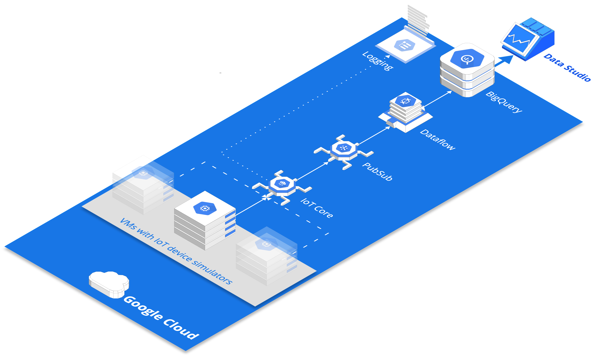

# pre-requisites

- cloud sdk  
```bash
brew cask install google-cloud-sdk
gcloud init
gcloud components update
gcloud auth application-default login
```
- terraform
```bash
brew install terraform
```
- ssh key paired with your gitlab account
- repo
```bash
git clone git@gitlab.com:foo/iot-on-gcp
cd iot-on-gcp
```
- beam sdk
```bash
cd beam
virtualenv env
source env/bin/activate
pip install 'apache-beam[gcp]'
```

# spin up

1. create sa key and point env var to it
```bash
export GOOGLE_APPLICATION_CREDENTIALS={path to sa.json}
export TF_VAR_gac=$GOOGLE_APPLICATION_CREDENTIALS
```

2. initialize terraform
```bash
cd ..
terraform init
```

3. verify you are all set
```bash
terraform validate
terraform plan -out "main.tfplan"
```

4. create cloud infra
```bash
terraform apply "main.tfplan"
```
create dataflow job via console
```
template=pubsub topic to bigquery
topic=projects/{project}/topics/telemetry
bigquery table={project}:iot.telemetry
gcs bucket=gs://{project}-dataflow-staging/tmp
```

NB: repo also contains templated beam job with sliding window as well as terraform resource for it

5. deploy mqtt simulator
- ssh into vm, install dependencies, initilize gcp sdk
```bash
gcloud beta compute --project "{project id}" ssh --zone "europe-west1-b" "mqtt-client-{random id}"
sudo apt-get update
sudo apt-get install python-pip openssl git -y
sudo pip install pyjwt paho-mqtt cryptography
git clone https://gitlab.com/foo/iot-on-gcp
gcloud init
exit
```
- re-establish ssh tunnel, initialize device registry and auth
```bash
gcloud beta compute --project "{project id}" ssh --zone "europe-west1-b" "mqtt-client-{random id}"
cd iot-on-gcp/gce
export PROJECT_ID=$(gcloud config get-value project)
export REGION="us-central1"
chmod +x init.sh
./init.sh
```
- run simulations
to deploy IoT fleet with 20 devices posting 10,000 signals each in background
```bash
chmod +x run_fleet.sh
./run_fleet.sh
```
to deploy single device posting signals in foreground
```bash
chmod +x run_one.sh
./run_one.sh {device name} {number of signals}
```

# infrastructure walkthrough
##### fleet of 20 device simulators
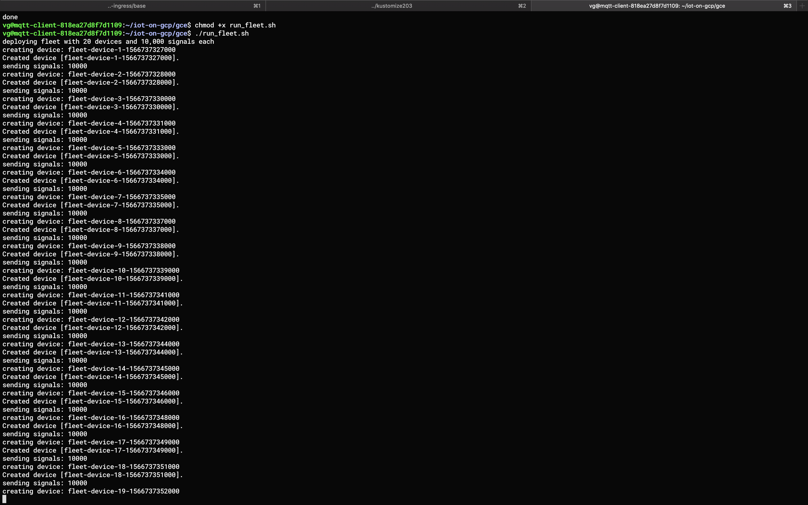
##### simulator emits temperature & humidity readings at the rate 10 per second
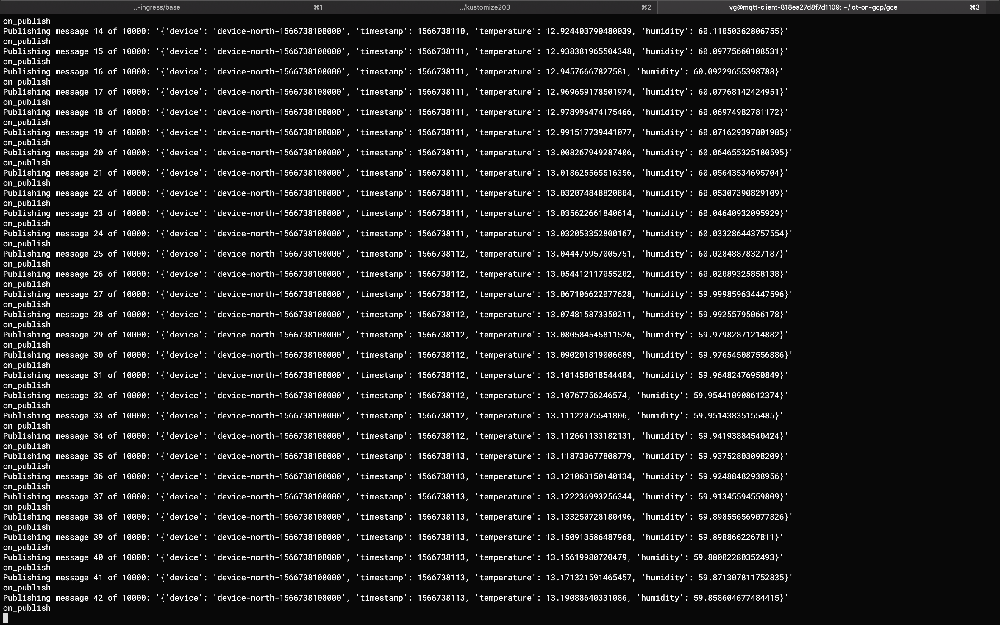
##### iot core receives data and publishes it to pubsub
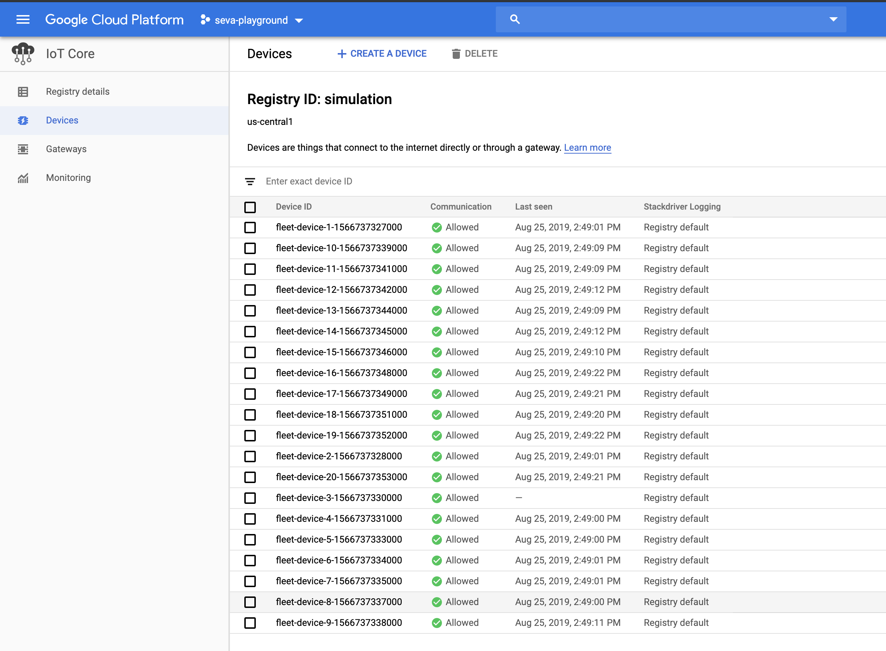
##### pubsub topic
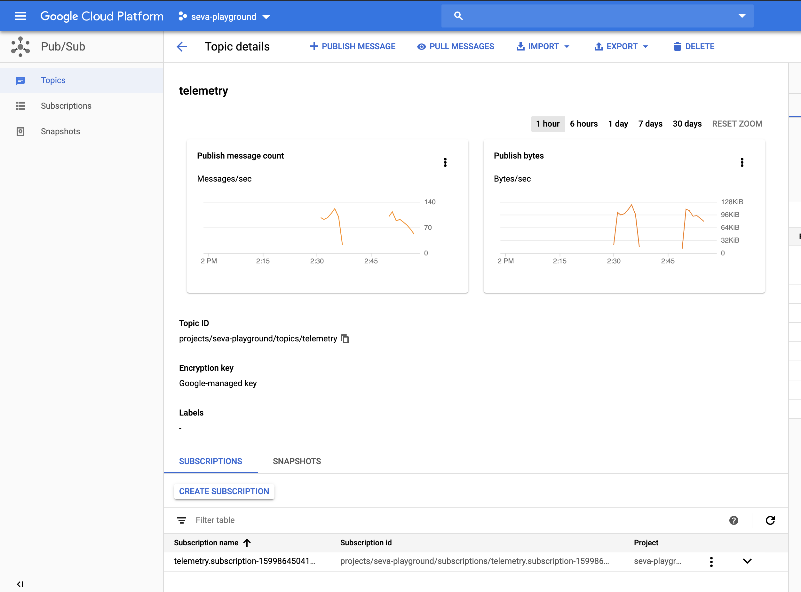
##### dataflow ingests data from pubsub topic and sinks it to warehouse
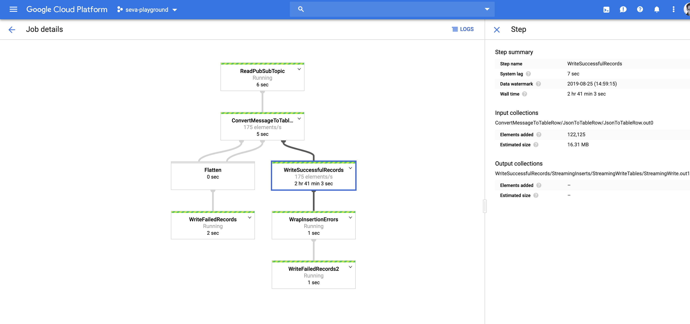
##### data is stored in bigquery
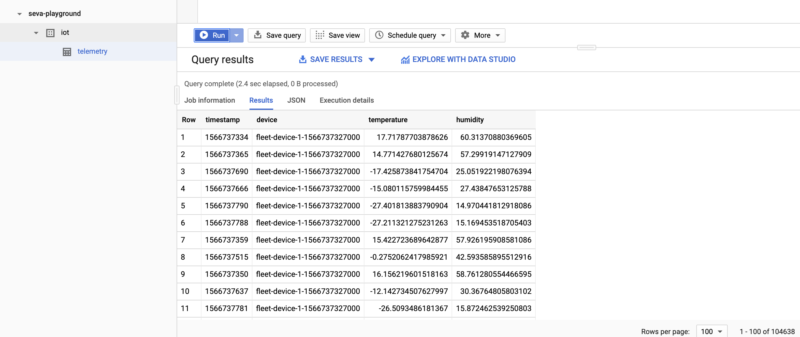
##### data studio report fed from bigquery
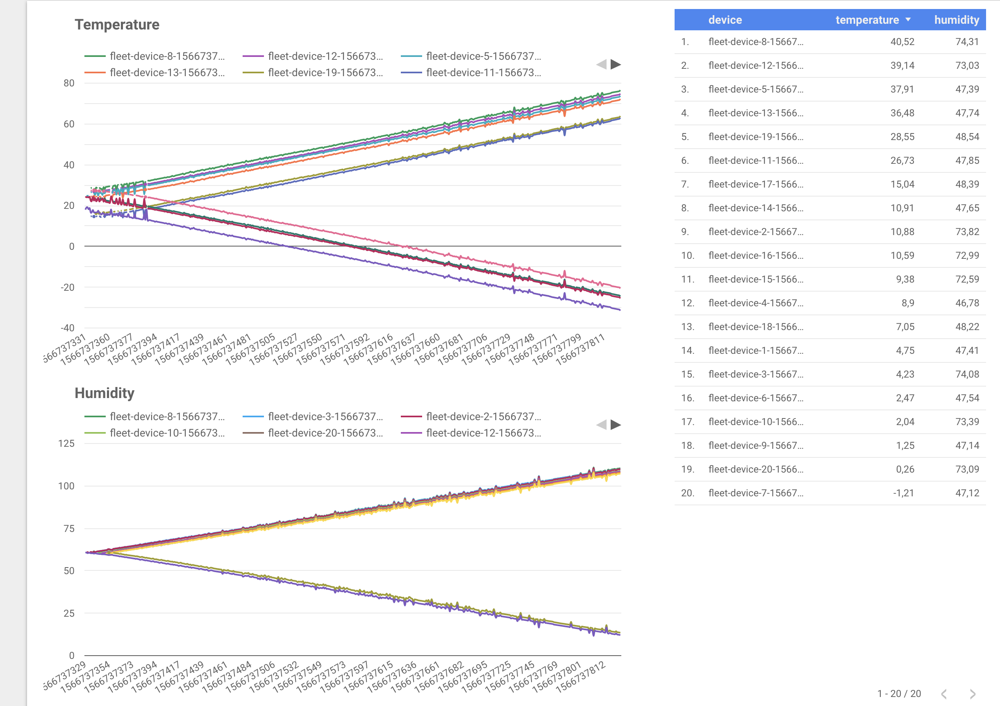

# analyzing with BigQuery ML
models supported:
*  linear regression: numeric values, i.e. value of smth
*  logistic regression: binary or multiclass classification, i.e. is smth
*  k-means clustering: unsupervised learning exploration

objective: predict temperature

##### train linear regression model
```sql
CREATE OR REPLACE MODEL `iot.predict_temperature_v0`
OPTIONS(model_type='linear_reg') AS
SELECT
 humidity,
 device,
 temperature as label
FROM
  `iot.telemetry`
```
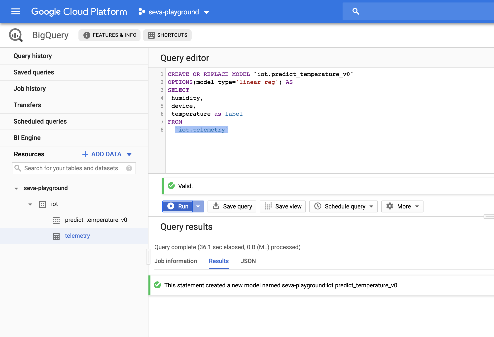
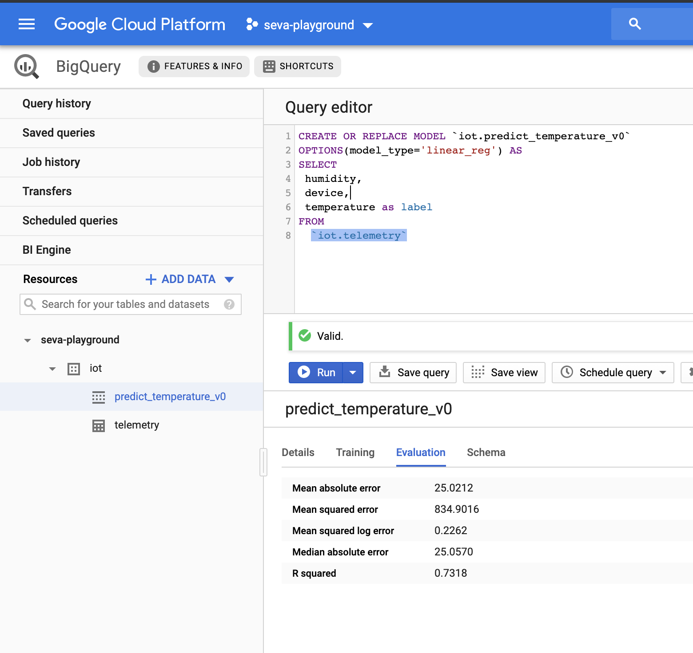

##### evaluate
```sql
WITH eval_table AS (
SELECT
 humidity,
 device,
 temperature as label
FROM
  iot.telemetry
)
SELECT
  *
FROM
  ML.EVALUATE(MODEL iot.predict_temperature_v0,
    TABLE eval_table)
```
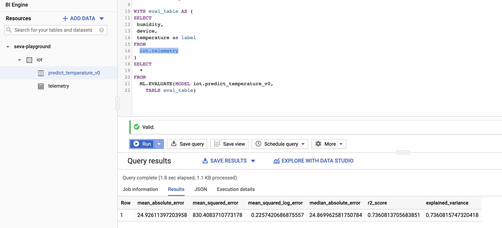

##### feature engineering: add temperature
```sql
CREATE OR REPLACE MODEL `iot.predict_temperature_v1`
OPTIONS(model_type='linear_reg') AS
SELECT
 timestamp,
 humidity,
 device,
 temperature as label
FROM
  `iot.telemetry`
```

```sql
WITH eval_table AS (
SELECT
 timestamp,
 humidity,
 device,
 temperature as label
FROM
  iot.telemetry
)
SELECT
  *
FROM
  ML.EVALUATE(MODEL iot.predict_temperature_v1,
    TABLE eval_table)
```
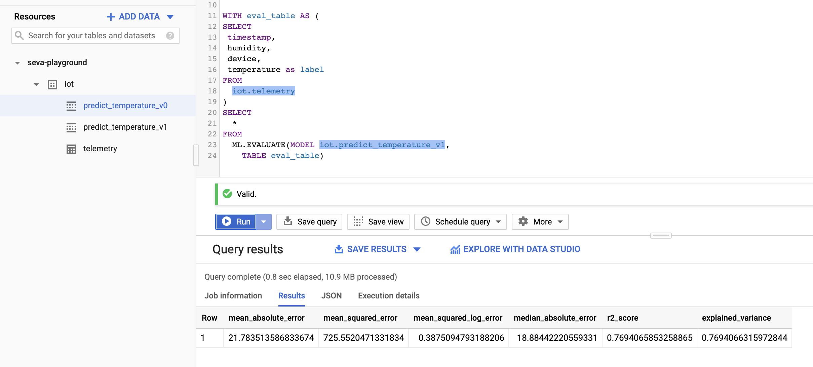

r2 increases, err decreases

##### predict
i.e. device 19. ended with t 60 and hum 17. if we bump down hum t will be even higher

```sql
WITH pred_table AS (
SELECT
  'fleet-device-19-1566737352000' as device,
  11.0 as humidity,
  1566737789 as timestamp
)
SELECT
  *
FROM
  ML.PREDICT(MODEL `iot.predict_temperature_v1`,
    TABLE pred_table)
```
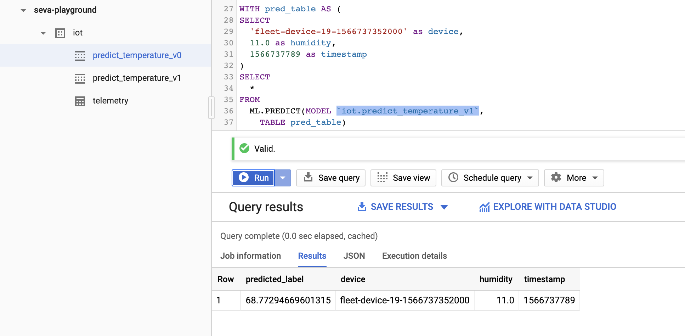

# tear down

- destroy cloud infra
```bash
terraform destroy
```
- stop dataflow job
- delete iot core registry